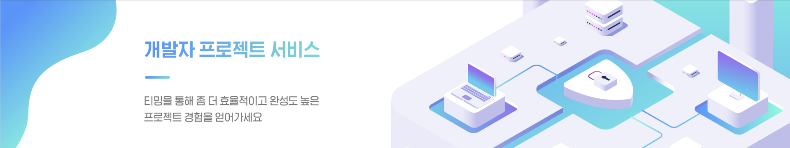

# 👩🏻‍💻 Teaming 
```
티밍은 실력이 비슷한 개발자들을 매칭시켜 개발 효율과 완성도를 높이기 위한 플랫폼입니다.
회원가입 시 '깃허브 닉네임'을 입력받아 유저의 모든 프로젝트를 분석해 기술 스택별 숙련도를 구한 뒤
'자카드 연산'을 개선한 추천 알고리즘을 바탕으로 한 구인 구직 기능을 제공합니다.

✨기술 스택별 숙련도는 언제든 개선할 수 있습니다.✨
```

## 🍎 프로젝트 소개
```
2023-2 공개SW프로젝트 수업에서 진행한 프로젝트입니다.
2023.09.01 ~ 2023.12.20
```

## 🙆🏻‍♀️ Team
✨ **2023-2-OSSP1-DguHeroes-2** ✨
| 팀 | 이름 | 전공 | 역할  | 깃허브 아이디 |
|----| ----- | ----- | -------- | ------- |
| 팀장 | 유수민 | 컴퓨터공학전공 | 인프라 구축, 백앤드, 프론트앤드  | proysm |
| 팀원 | 이기백 | 컴퓨터공학전공 | 깃허브 크롤링, 유저 숙련도 계산  | dgu2022 |
| 팀원 | 임성혁 | 컴퓨터공학전공 | 추천 알고리즘 개선, 백앤드  | dailyrunner |
| 팀원 | 문현우 | 컴퓨터공학전공 | 정량적 평가, 프론트앤드  | m00nhyunw00 |

## 1. 개발 환경 및 기술 스택
**✨Front** <br>


**✨Back** <br>


**✨GitHub Crawlling** <br>


## 2. 프로젝트 전체 구조

✨각각의 단위를 캡슐화✨ 

```
1. 업데이트에 용이하고 코드에 이상이 생겼을 때도 해결하기 쉽다. 
2. GitHub, SonarCube와 같은 볼륨이 큰 프로젝트를 함께 실행시키면 느리고 유지보수에 어렵지만 캡슐화하므로써 이러한 단점을 해결하였다. 
3. 같은 Back과 User 기술 스택별 숙련도 계산은 같은 가상 서버(EC2)에 배포하여 통신이 쉽도록 했다.
```


## 3. 프로젝트 디렉토리 구조
<details>
<summary>Frontend 구조 확인하기</summary>
<div markdown="1">

```
src
├── api
│   ├── base.ts
│   ├── getMainInfo.ts
│   ├── getProjectDetails.ts
│   ├── getProjectList.ts
│   ├── getUserInfo.ts
│   ├── getUserProjectManageAply.ts
│   ├── getUserProjectManageRecommend.ts
│   ├── getUserprojectList.ts
│   ├── postProjectCreate.ts
│   ├── postUpdateUrs.ts
│   ├── postUserJoin.ts
│   ├── postUserLogin.ts
│   ├── postUserLogout.ts
│   └── postUserProjectManageHire.ts
├── assets
│   └── images
│       ├── card
│       │   ├── card_img1.png
│       │   ├── card_img2.png
│       │   ├── card_img3.png
│       │   ├── card_img4.png
│       │   └── card_img5.png
│       ├── default_background.png
│       ├── logo.png
│       ├── main
│       │   ├── banner_background.png
│       │   ├── project_list_icon1.png
│       │   └── project_list_icon2.png
│       ├── missing_avatar.png
│       ├── profile
│       │   ├── github.png
│       │   └── insta.png
│       └── project
│           └── titleIcon.png
├── components
│   ├── CommonHeader
│   │   ├── CommonHeader.tsx
│   │   ├── index.ts
│   │   └── styled.ts
│   ├── Display
│   │   ├── Display.tsx
│   │   ├── index.ts
│   │   └── styled.ts
│   ├── ManageProjectCard
│   │   ├── ManageProjectCard.tsx
│   │   ├── index.ts
│   │   └── styled.ts
│   ├── ProjectCard
│   │   ├── ProjectCard.tsx
│   │   ├── index.ts
│   │   └── styled.ts
│   ├── Question
│   │   ├── Question.tsx
│   │   ├── index.ts
│   │   └── styled.ts
│   └── QuestionnaireModal
│       ├── QuestionnaireModal.tsx
│       ├── index.ts
│       └── styled.ts
├── constants
│   ├── json
│   │   ├── apply_project_list_sample.json
│   │   ├── expire_project_list_sample.json
│   │   ├── invited_project_list_sample copy.json
│   │   ├── manage_project_list_sample.json
│   │   ├── project_list_sample.json
│   │   ├── questionnaire_list_sample.json
│   │   ├── questionnaire_sample.json
│   │   ├── user_list_sample.json
│   │   └── user_manage_list_sample.json
│   ├── project
│   │   ├── developmentStack.ts
│   │   └── locationOptions.ts
│   └── system
│       ├── layout.ts
│       ├── paramFilter.ts
│       └── url.ts
├── global.d.ts
├── hooks
│   └── useModal.ts
├── index.tsx
├── pages
│   ├── Admin
│   │   ├── QuestionnaireDetails
│   │   │   ├── AdminQuestionnaireDetailsPage.tsx
│   │   │   ├── components
│   │   │   │   └── EditableQuestionCard
│   │   │   │       ├── EditableQuestionCard.tsx
│   │   │   │       ├── index.ts
│   │   │   │       └── styled.ts
│   │   │   ├── index.ts
│   │   │   └── styled.ts
│   │   └── QuestionnaireList
│   │       ├── AdminQuestionnaireListPage.tsx
│   │       ├── index.ts
│   │       └── styled.ts
│   ├── Join
│   │   ├── JoinPage.tsx
│   │   ├── index.ts
│   │   └── styled.ts
│   ├── Login
│   │   ├── LoginPage.tsx
│   │   ├── index.ts
│   │   └── styled.ts
│   ├── Main
│   │   ├── BannerSection
│   │   │   ├── BannerSection.tsx
│   │   │   ├── index.ts
│   │   │   └── styled.ts
│   │   ├── MainPage.tsx
│   │   ├── PopularProjectListSection
│   │   │   ├── PopularProjectListSection.tsx
│   │   │   ├── index.ts
│   │   │   └── styled.ts
│   │   ├── RecentProjectListSection
│   │   │   ├── RecentProjectListSection.tsx
│   │   │   ├── index.ts
│   │   │   └── styled.ts
│   │   ├── RecommendProjectListSection
│   │   │   ├── RecommendProjectListSection.tsx
│   │   │   ├── index.ts
│   │   │   └── styled.ts
│   │   ├── index.ts
│   │   └── styled.ts
│   ├── Project
│   │   ├── Details
│   │   │   ├── ProjectDetailsPage.tsx
│   │   │   ├── index.ts
│   │   │   └── styled.ts
│   │   └── List
│   │       ├── ProjectListPage.tsx
│   │       ├── index.ts
│   │       └── styled.ts
│   ├── Recommend
│   │   └── RecommendUsers
│   │       └── RecommendModal.tsx
│   └── User
│       ├── Notice
│       │   ├── Details
│       │   │   ├── UserNoticeDetailsPage.tsx
│       │   │   ├── index.ts
│       │   │   └── styled.ts
│       │   └── List
│       │       ├── UserNoticeListPage.tsx
│       │       ├── index.ts
│       │       └── styled.ts
│       ├── Profile
│       │   ├── UserProfilePage.tsx
│       │   ├── index.ts
│       │   ├── profileHeader
│       │   │   ├── index.ts
│       │   │   ├── profileHeader.tsx
│       │   │   └── styled.ts
│       │   └── styled.ts
│       └── Project
│           ├── Create
│           │   ├── CreateProjectSection
│           │   │   ├── CreateProjectSection.tsx
│           │   │   ├── index.ts
│           │   │   └── styled.ts
│           │   ├── UserProjectCreatePage.tsx
│           │   ├── index.tsx
│           │   └── styled.ts
│           ├── Manage
│           │   ├── ApproveMemberSection
│           │   │   ├── ApproveMemberSection.tsx
│           │   │   ├── index.ts
│           │   │   └── styled.ts
│           │   ├── ChangeProjectSection
│           │   │   ├── ChangeProjectSection.tsx
│           │   │   ├── index.ts
│           │   │   └── styled.ts
│           │   ├── ManageMemberSection
│           │   │   ├── ManageMemberSection.tsx
│           │   │   ├── index.ts
│           │   │   └── styled.ts
│           │   ├── SearchMemberSection
│           │   │   ├── SearchMemberSection.tsx
│           │   │   ├── index.ts
│           │   │   └── styled.ts
│           │   ├── UserProjectManagePage.tsx
│           │   ├── index.ts
│           │   └── styled.ts
│           ├── UserProjectPage.tsx
│           ├── index.ts
│           └── styled.ts
├── styles
│   └── global.css
├── types
│   ├── project.ts
│   ├── questionnaire.ts
│   ├── stacks.ts
│   └── testdata.ts
└── utils
    ├── camelizeKey.ts
    ├── cookies.ts
    ├── decamelizeKey.ts
    ├── generateQueryKey.ts
    ├── generateRandomProjectCardLogoImg.ts
    ├── gradeQuestionnaire.ts
    ├── translateDevelopmentStack.ts
    ├── translatePosition.ts
    └── translateStatus.ts
```

</div>
</details>

<details>
<summary>Backend 구조 확인하기</summary>
<div markdown="1">

```
src
└── main
    ├── java
    │   └── com
    │       └── example
    │           └── demo
    │               ├── CorsConfig.java
    │               ├── DemoApplication.java
    │               ├── Main
    │               │   └── MainInfo.java
    │               ├── SpringConfig.java
    │               ├── apiPayload
    │               │   ├── ApiResponse.java
    │               │   ├── code
    │               │   │   ├── BaseCode.java
    │               │   │   ├── BaseErrorCode.java
    │               │   │   ├── ErrorReasonDTO.java
    │               │   │   ├── ReasonDTO.java
    │               │   │   └── status
    │               │   │       ├── ErrorStatus.java
    │               │   │       └── SuccessStatus.java
    │               │   └── exception
    │               │       └── GeneralException.java
    │               ├── constant
    │               │   └── Role.java
    │               ├── controller
    │               │   ├── AdminController.java
    │               │   ├── HelloController.java
    │               │   ├── MainController.java
    │               │   ├── ProjectController.java
    │               │   ├── UserController.java
    │               │   ├── userRecommendCalc
    │               │   │   └── UserRecommendController.java
    │               │   └── userScoreCalc
    │               │       └── UserScoreController.java
    │               ├── domain
    │               │   ├── Apply.java
    │               │   ├── Hello.java
    │               │   ├── Invitation.java
    │               │   ├── Project.java
    │               │   ├── ProjectLike.java
    │               │   ├── ProjectMember.java
    │               │   ├── User.java
    │               │   ├── position
    │               │   │   ├── PositionBase.java
    │               │   │   ├── ProjectBack.java
    │               │   │   ├── ProjectEtc.java
    │               │   │   └── ProjectFront.java
    │               │   └── stacks
    │               │       ├── Angular.java
    │               │       ├── AngularJs.java
    │               │       ├── ApacheSpark.java
    │               │       ├── AspNet.java
    │               │       ├── Blazor.java
    │               │       ├── C.java
    │               │       ├── CSharp.java
    │               │       ├── Cpp.java
    │               │       ├── Dart.java
    │               │       ├── Django.java
    │               │       ├── DotNet.java
    │               │       ├── Electron.java
    │               │       ├── Express.java
    │               │       ├── Flask.java
    │               │       ├── Flutter.java
    │               │       ├── Go.java
    │               │       ├── HtmlCss.java
    │               │       ├── Java.java
    │               │       ├── JavaScript.java
    │               │       ├── Jquery.java
    │               │       ├── Keras.java
    │               │       ├── Kotlin.java
    │               │       ├── Laravel.java
    │               │       ├── Lua.java
    │               │       ├── NestJs.java
    │               │       ├── NextJs.java
    │               │       ├── NodeJs.java
    │               │       ├── OpenCv.java
    │               │       ├── OpenGl.java
    │               │       ├── Pandas.java
    │               │       ├── Php.java
    │               │       ├── PyTorch.java
    │               │       ├── Python.java
    │               │       ├── Qt.java
    │               │       ├── R.java
    │               │       ├── RabbitMq.java
    │               │       ├── React.java
    │               │       ├── ReactNative.java
    │               │       ├── Ruby.java
    │               │       ├── RubyOnRails.java
    │               │       ├── Rust.java
    │               │       ├── ScikitLearn.java
    │               │       ├── SpringBoot.java
    │               │       ├── StackBase.java
    │               │       ├── Svelte.java
    │               │       ├── Swift.java
    │               │       ├── SwiftUi.java
    │               │       ├── TensorFlow.java
    │               │       ├── Torch.java
    │               │       ├── TypeScript.java
    │               │       └── VueJs.java
    │               ├── dto
    │               │   ├── GithubIdDTO.java
    │               │   ├── HireInfo.java
    │               │   ├── ProjectLikeDTO.java
    │               │   ├── StackDTO.java
    │               │   ├── UserProjectList.java
    │               │   └── UserScoreDTO.java
    │               ├── repository
    │               │   ├── ApplyRepository.java
    │               │   ├── ApplyRepositoryImpl.java
    │               │   ├── InvitationRepository.java
    │               │   ├── InvitationRepositoryImpl.java
    │               │   ├── ProjectLikeRepository.java
    │               │   ├── ProjectLikeRepositoryImpl.java
    │               │   ├── ProjectMemberRepository.java
    │               │   ├── ProjectMemberRepositoryImpl.java
    │               │   ├── ProjectRepository.java
    │               │   ├── ProjectRepositoryImpl.java
    │               │   ├── ResponseRepository.java
    │               │   ├── ResponseRepositoryImpl.java
    │               │   ├── UserJPARepository.java
    │               │   ├── UserRepository.java
    │               │   ├── UserRepositoryImpl.java
    │               │   └── stacks
    │               │       ├── AngularJsRepository.java
    │               │       ├── AngularRepository.java
    │               │       ├── ApacheSparkRepository.java
    │               │       ├── AspNetRepository.java
    │               │       ├── BlazorRepository.java
    │               │       ├── CRepository.java
    │               │       ├── CSharpRepository.java
    │               │       ├── CppRepository.java
    │               │       ├── DartRepository.java
    │               │       ├── DjangoRepository.java
    │               │       ├── DotNetRepository.java
    │               │       ├── ElectronRepository.java
    │               │       ├── ExpressRepository.java
    │               │       ├── FlaskRepository.java
    │               │       ├── FlutterRepository.java
    │               │       ├── GoRepository.java
    │               │       ├── HtmlCssRepository.java
    │               │       ├── JavaRepository.java
    │               │       ├── JavaScriptRepository.java
    │               │       ├── JqueryRepository.java
    │               │       ├── KerasRepository.java
    │               │       ├── KotlinRepository.java
    │               │       ├── LaravelRepository.java
    │               │       ├── LuaRepository.java
    │               │       ├── NestJsRepository.java
    │               │       ├── NextJsRepository.java
    │               │       ├── NodeJsRepository.java
    │               │       ├── OpenCvRepository.java
    │               │       ├── OpenGlRepository.java
    │               │       ├── PandasRepository.java
    │               │       ├── PhpRepository.java
    │               │       ├── PyTorchRepository.java
    │               │       ├── PythonRepository.java
    │               │       ├── QtRepository.java
    │               │       ├── RRepository.java
    │               │       ├── RabbitMqRepository.java
    │               │       ├── ReactNativeRepository.java
    │               │       ├── ReactRepository.java
    │               │       ├── RubyOnRailsRepository.java
    │               │       ├── RubyRepository.java
    │               │       ├── RustRepository.java
    │               │       ├── ScikitLearnRepository.java
    │               │       ├── SpringBootRepository.java
    │               │       ├── SvelteRepository.java
    │               │       ├── SwiftRepository.java
    │               │       ├── SwiftUiRepository.java
    │               │       ├── TensorFlowRepository.java
    │               │       ├── TorchRepository.java
    │               │       ├── TypeScriptRepository.java
    │               │       └── VueJsRepository.java
    │               ├── response
    │               │   ├── AdminResponse.java
    │               │   ├── CommonResponse.java
    │               │   ├── ListResponse.java
    │               │   ├── ResponseService.java
    │               │   └── SingleResponse.java
    │               └── service
    │                   ├── ApplyService.java
    │                   ├── InvitationService.java
    │                   ├── ProjectLikeService.java
    │                   ├── ProjectMemberService.java
    │                   ├── ProjectService.java
    │                   ├── UserScoreService.java
    │                   ├── UserService.java
    │                   └── recommendCalc
    │                       ├── AccessDB.java
    │                       ├── GetDistance.java
    │                       ├── Recommend.java
    │                       └── Urs.java
    └── resources
        ├── application.yml
        ├── data.sql
        └── http
```

</div>
</details>

<details>
<summary>GitHub Crawlling 구조 확인하기</summary>
<div markdown="1">

```
.
├── __pycache__
│   ├── common_variable.cpython-310.pyc
│   ├── common_variable.cpython-36.pyc
│   ├── common_variable.cpython-38.pyc
│   ├── get_profile.cpython-310.pyc
│   ├── get_profile.cpython-36.pyc
│   ├── get_profile.cpython-38.pyc
│   ├── github_score_12.cpython-310.pyc
│   ├── github_score_12.cpython-36.pyc
│   ├── github_score_12.cpython-38.pyc
│   ├── github_score_3.cpython-310.pyc
│   ├── github_score_3.cpython-36.pyc
│   ├── github_score_3.cpython-38.pyc
│   ├── github_score_4.cpython-310.pyc
│   ├── github_score_4.cpython-36.pyc
│   ├── github_score_4.cpython-38.pyc
│   ├── github_score_5.cpython-310.pyc
│   ├── github_score_5.cpython-36.pyc
│   ├── github_score_5.cpython-38.pyc
│   ├── main.cpython-310.pyc
│   ├── main.cpython-36.pyc
│   ├── main.cpython-38.pyc
│   ├── sonar_crawling.cpython-310.pyc
│   ├── sonar_crawling.cpython-36.pyc
│   └── sonar_crawling.cpython-38.pyc
├── common_variable.py
├── dailyrunner_sonar_data.pkl
├── dockerfile
├── env
│   ├── __pycache__
│   │   └── settings.cpython-310.pyc
│   └── settings.py
├── get_profile.py
├── github_score_12.py
├── github_score_3.py
├── github_score_4.py
├── github_score_5.py
├── main.py
├── project_data_last1.pkl
├── project_data_last2.pkl
├── project_data_last3.pkl
├── project_data_last4.pkl
├── project_data_last5.pkl
├── project_data_last6.pkl
├── project_data_last7.pkl
├── project_data_last8.pkl
├── project_data_last_real.pkl
├── requirements.txt
├── sonar_crawling.py
└── vercel.json
```

</div>
</details>

## 4. 기능 소개

```
- 깃허브 닉네임 입력 시 해당 유저의 모든 기술 스택별 숙련도 산출
- 유저가 프로젝트 매칭 시 가장 평균 숙련도가 비슷한 프로젝트 우선순위로 추천
- 팀장이 팀원 매칭 시 가장 평균 숙련도가 비슷한 유저 우선순위로 추천
- 위 매칭 알고리즘에 지식 그래프를 적용하여 상관관계가 있는 기술 스택의 숙련도도 반영
- 웹사이트 회원가입/로그인 기능
```

## 5. 개선 결과
### 정량적 평가 방법
　이번 프로젝트의 추천알고리즘이 최초 프로젝트의 추천 알고리즘보다 성능이 나음을 보이기 위해 정량화하여 평가를 진행하였다. 정량화하고자 하는 것은 추천 알고리즘 성능이다. 어떤 추천 알고리즘이 실력이 비슷한 유저를 더 잘 추천해주는지를 알아보고자 하였다. 이를 위해 어떤 알고리즘에서도 사용하는 지표가 아닌 GitHub Stats Generator에서 도출한  점수(0에서  100 사이)를 사용하여 측정함으로서 객관성을 확보하고자 하였다.

1. 유저들  중 무작위로 한명을 팀장으로 정해 팀을 구성한다.
2. 프로젝트에  필요한 기술  스택(프레임워크)을  무작위로  정하여 프로젝트를 만든다.
3.
　　　　1. 전 프로젝트의 알고리즘 기준 팀원 10명을 정렬하고 최대 유사도를 갖는 유저를 역할 별로 한명씩 찾는다.
　　　　2. 본 프로젝트의 알고리즘 기준 팀원 10명을 정렬하고 최대 유사도를 갖는 유저를 역할 별로 한명씩 찾는다.
4.
　　　　1. 역할 별 1위 유저들에 대해서 GitHub Stats를 구한 뒤, GitHub Stats에 대해서 표준편차를 구한다.
　　　　2. 역할 별 1위 유저들에 대해서 GitHub Stats를 구한 뒤, GitHub Stats에 대해서 표준편차를 구한다.
5. 1번부터 4번의 과정을  50번 반복하여 a,b 각각 50개의 표준편차들을 구한다.
6. 위 과정을 통해 나온 샘플들의 표준편차의 합이 더 작게 나오는 쪽이 더 성능이 좋은 알고리즘이다.

　위의 과정을 통해 구한 이번 프로젝트에서 얻은 데이터의 표준편차의 합은 543.9959이고, 최초 프로젝트에서 얻은 데이터의 표준편차의 합은 567.9385이다. (표준편차의 평균은 각각 10.87992, 11.35877) 근소하지만 이번 프로젝트가 최초프로젝트보다 더 좋은 성능을 냈다고 할 수 있다. 만약 향후에 더 많은 데이터로 테스트할 수 있다면 표준편차의 합의 차이도 유의미하게 낼 수 있을 것이라고 생각한다.

### 데이터
1. [크롤링한 깃허브 데이터 확인하기](https://github.com/CSID-DGU/2023-2-OSSP1-DguHeroes-2/tree/main/file "crawling_data")
2. [정량적 평가 계산 과정 확인하기](https://github.com/CSID-DGU/2023-2-OSSP1-DguHeroes-2/tree/main/file "raw data")
3. [neo4j Knowledge Graph 확인하기](https://github.com/CSID-DGU/2023-2-OSSP1-DguHeroes-2/tree/main/file "data-importer")


## ✏️ 사용법 
**✨공통 사항**
```git
git clone https://github.com/CSID-DGU/2023-2-OSSP1-DguHeroes-2
```

**✨Frontend**
```linux
cd Frontend
npm start
// npm package 설치 필요
```

**✨Backend**
```linux
cd Backend
// build.gradle을 Open as Project로 열기
```

**✨GitHub Crawlling**
```linux
cd Recommend/userScore
uvicorn main:app —reload —host 0.0.0.0
// 자신의 환경에 따라 module 설치 필요	
```

**✨Knowledge Graph** <br>
데이터에 첨부된 knowledge  graph를 neo4j aura에서 import한다.
백엔드와 연결하기 위해 java-neo4j- driver를 사용한다. (GetDistance.java)

## 🌴 Branch
| 이름 | 설명 |
| --- | --- |
| main | PR을 거쳐 오류가 없는 브랜치 |
| back | BE 기능 개발 및 관리 |
| front | FE 기능 개발 및 관리 |
| recommend | 추천 기능 개발 및 관리 |
| crawlling | gitHub 크롤링 및 유저 스택의 숙련도 계산 |


## 🎯 Commit Convention
| 제목 | 설명 |
| --- | --- |
| Feat: | 새로운 기능 추가 |
| Fix: | 버그 수정 |
| Docs: | 문서 수정 |
| Update: | 기타 업데이트 |
| Style: | 코드 포맷 변경, 세미콜론 누락, 코드 변경 없음 |
| Refactor: | 프로덕션 코드 리팩터링 |
| Comment: | 주석 생성, 수정 및 삭제 |
| test: | 테스트 추가, 테스트 코드 리팩터링, 프로덕션 코드 변경 없음 |
| Chore: | 빌드 테스크 업데이트, 패키지 매니저 환경설정, 프로덕션 코드 변경 없음 |

## 🎀 Meeting Miutes
[회의록 확인](https://proysm.notion.site/5f0655b639e44e0ab22dedae26837443?v=cce514070dc14e55b18c399f0a17c3f2&pvs=4 "teaming 회의록")


## 🔮 Reference
1. [2023-1.ver](https://github.com/CSID-DGU/2023-1-OSSP1-colorful-7?tab=readme-ov-file "동국대학교 teaming")
2. [2022.ver](https://github.com/kookmin-sw/capstone-2022-17 "국민대학교 teaming")

